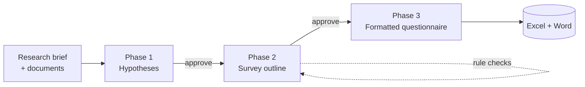

# Hypothesis-Driven Survey Generator

Turn research objectives into a **validated, field-ready survey** — automatically.

Feed in a research brief and background documents; get back a structured survey outline
(Excel) and a fully formatted questionnaire (Word). Every question is anchored to a research
hypothesis, every draft is checked against a deterministic rule engine, and a human reviews and
approves at each step.

<p>
  
  
  
</p>

> **Why it exists:** writing a good survey is slow and inconsistent. The first draft can take a
> team a week, and quality depends on who happens to hold the pen. This tool gets you to a
> defensible first draft in hours — without giving up human control.

---

## ✨ Highlights

- **Hypothesis-driven** — nothing gets asked unless it earns its place against a research hypothesis. Coverage is tracked end-to-end.
- **Self-correcting** — a deterministic validator finds problems (blockers *and* warnings), sends them back for revision, and re-checks in a loop until the survey is clean.
- **Human-in-the-loop** — you review and approve at every phase gate; edit questions inline or via CSV round-trip.
- **Reproducible output** — the final Word/Excel documents are generated by pure Python (no LLM), so the same input always produces the same document.
- **Multi-provider** — works with Anthropic, OpenAI, Google Gemini, or Groq.

## 🧭 How it works



| Phase | Input → Output | Powered by |
|-------|----------------|-----------|
| **1 — Research** | Brief + source docs → research hypotheses | LLM + clarifying questions |
| **2 — Design** | Hypotheses → survey outline | LLM drafting + a **closed-loop rule validator** |
| **3 — Render** | Outline → formatted Word questionnaire | **Pure Python — deterministic, no LLM** |

A human approves at the gate after each phase.

## 🚀 Quick start

**Requirements:** Python 3.11+ and an API key for at least one LLM provider
(Anthropic, OpenAI, Google Gemini, or Groq).

```bash
# 1. Clone
git clone https://github.com/<your-username>/<your-repo>.git
cd <your-repo>

# 2. Install
python -m venv .venv
# Windows:
.venv\Scripts\python.exe -m pip install -r requirements.txt
# macOS / Linux:
# source .venv/bin/activate && pip install -r requirements.txt

# 3. Run
python -m streamlit run survey_generator/app.py
```

Then open **http://localhost:8501** in your browser.

## 🔑 Configuration

Paste your API key directly into the app's sidebar, **or** create a `.env` file inside
`survey_generator/` (copy the provided `.env.example`):

```env
ANTHROPIC_API_KEY=your-key-here
# or OPENAI_API_KEY / GOOGLE_API_KEY / GROQ_API_KEY
```

See `survey_generator/.env.example` for all options (provider keys, auth mode, upload limits,
file-retention, optional OCR for scanned PDFs).

## 🧠 Under the hood

The design deliberately separates **creative generation** (LLM) from **judgment and rendering**
(deterministic code):

- **LLM-as-a-function** — each step is a prompt that returns typed JSON, validated against a schema.
- **Task decomposition** — a pipeline of narrow specialists (suggest → draft → review → revise) instead of one mega-prompt.
- **Orchestrator–worker** — one editor plans changes holistically across the whole survey; section-level workers apply them in parallel.
- **Closed-loop self-correction** — a pure-Python validator drives repair rounds until the rules pass. The model never grades its own work.
- **Grounding & traceability** — every question links back to a hypothesis, reducing drift and hallucination.
- **Deterministic rendering** — the Excel and Word outputs are produced without any LLM, so they're auditable and reproducible.

## 📂 Project structure

```
survey_generator/
├── app.py            # Streamlit UI (all phases, one app)
├── phase1/           # research → hypotheses
├── phase2/           # hypotheses → survey outline + closed-loop validator
├── phase3/           # outline → formatted Word doc (deterministic renderer)
├── llm/              # multi-provider LLM client + prompt builders
├── prompts/          # prompt templates that drive each step
├── contract.py       # the survey-outline column contract
├── tests/            # pytest suite
└── sample_workbook.xlsx
requirements.txt
```

## 🧪 Testing

```bash
python -m pytest survey_generator/tests -q
```

## 🤝 Contributing

Issues and pull requests are welcome. For larger changes, please open an issue first to discuss
what you'd like to change.

## 📄 License

Released under the [MIT License](LICENSE).
